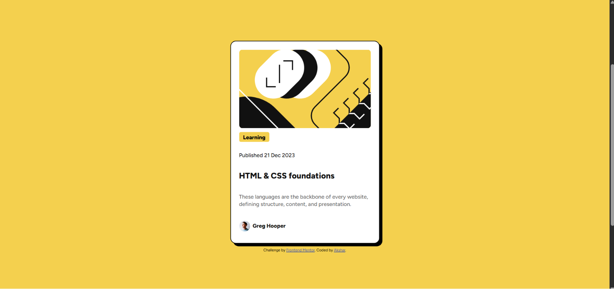

# Frontend Mentor - Blog preview card solution

This is a solution to the [Blog preview card challenge on Frontend Mentor](https://www.frontendmentor.io/challenges/blog-preview-card-ckPaj01IcS). Frontend Mentor challenges help you improve your coding skills by building realistic projects. 

## Table of contents

- [Overview](#overview)
  - [The challenge](#the-challenge)
  - [Screenshot](#screenshot)
  - [Links](#links)
- [My process](#my-process)
  - [Built with](#built-with)
  - [What I learned](#what-i-learned)
  - [Continued development](#continued-development)
  - [AI Collaboration](#ai-collaboration)
- [Author](#author)

## Overview

### The challenge

Users should be able to:

- See hover and focus states for all interactive elements on the page

### Screenshot

### Links

- Solution URL: https://github.com/Akshar-u-2077/blog-preview-card.git
- Live Site URL: https://akshar-u-2077.github.io/blog-preview-card/

## My process

### Built with

- Semantic HTML5 markup
- CSS custom properties
- Flexbox

### What I learned

usage of flexbox, max-width:fit-content
perfect practice to learn padding.

### Continued development

i need to focus on alignment of elements. I mess up alignment there everytime.

### AI Collaboration

Used Claude Opus, and Thankfull to it. Learned alot from it.

## Author

- Frontend Mentor - [@Akshar-u-2077](https://www.frontendmentor.io/profile/Akshar-u-2077)
